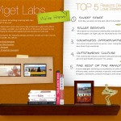
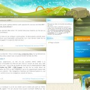
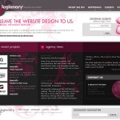

Tout les mois, j’essaierai de tenir à jour une liste de design de sites qui me paraissent particulièrement intéressant tout en les commentant. En naviguant sur le web, je suis souvent interpellé par des types de mise en pages ou par la beauté graphique. Voici donc mon top 5 ;)

### Team Viget Lab

J’ai été particulièrement séduit par la mise en page originale. Pour naviguer, il y a un défilement horizontal de la zone de contenu afin d’accéder aux autres rubriques. C’est assez original. Ceci est rendu possible grâce aux possibilités du Framework [Jquery](http://www.jquery.com/ "Se rendre sur le site du Framework Jquery") (mon chouchou) alliées au [plugin Easing](http://gsgd.co.uk/sandbox/jquery/easing/ "se rendre sur le site du projet de plugin Easing").

Certes, on pourra me faire remarquer que ce n’est pas très évolutif mais ici, on parle d’une vitrine montrant les possibilités de créations d’une équipe de designers :)

*   [Visiter le site de la Team Viget](http://www.teamviget.com/ "Se rendre sur le site Team Viget Labs")

### Goto CSS3

Le site suivant est très soigné graphiquement. La mise en page a été réalisée à l’aide d’une grille symétrique de 4 colonnes. Mais ce qui fait la beauté de ce design est surtout la minutie accordée aux différents éléments graphiques. L’auteur a réalisé un véritable travaille d’orfèvre sur les illustrations de la page et on se laisse soudain aller à quelques rêveries…

*   [Visiter le site Goto CSS3](http://www.gotocss3.com/ "Se rendre sur le site Goto CSS3")

### Legionary

Le design de ce site qui est en fait la vitrine d’une agence de webdesign (mais pas seulement) à retenu mon attention par son alliance de couleurs sombre (gris, noir) avec des couleurs plutôt flashy (rose). Le tout donne une apparence vivante grâce aux courbes en fond de pages qui sont décidément très tendances ;)

*   [Visiter le site de Legionary](http://www.legionarystudio.com/ "Se rendre sur le site Legionary")

### Patty Ho

Un autre joli design, celui de Patty Ho. Il se caractérise par des couleurs chaudes. Il y a des jeux de transparence et de contraste qui donnent à ce site, un style tout à fait particulier. Les différentes sections sont parfaitement délimitées par de larges marges.

On notera toutefois quelques bugs javascript notamment sur la partie diaporama qui expose les différents projets réalisés. Mais evidemment, il ne s'agit là que d'un détail dans l'unique but de chercher des poux :)

*   [Visiter le site de Patty Ho](http://www.pattyhodesign.com/ "Se rendre sur le site Patty Ho")

### Veerle's blog

Je ne pouvais pas conclure ce premier top 5 de design de site sans parler du blog de Veerle qui est l’alliance d’une mise en page basée sur une grille à la beauté graphique. L’utilisation de la grille est ici très intéressante car paradoxalement, la grille symétrique utilisée  laisse apparaître une mise en page asymétrique. Le résultat est plus que réussi. Le mélange encore une fois de couleurs sombres et de couleurs flashy donne toute l’intensité à la page. Il y a également tout un travail non négligeable sur l’orientation des éléments forçant la lecture des différentes rubriques. Ce design reste une référence pour pas mal de webdesigner.

*   [Visiter le blog de Veerle](http://veerle.duoh.com/ "Se rendre sur le blog de Veerle")
