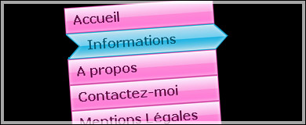
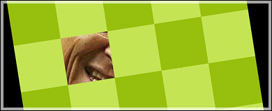

CSS a introduit des fonctionnalités très importantes pour le webdesign: les pseudo-éléments et les pseudo-classes.

Les pseudo-éléments sélectionnent une partie spécifique dans le Doctree (le formatage du document source) à partir des informations déjà données par ce dernier: nom, attribut... De fait, on peut appliquer un style sur une partie spécifique du document. Par exemple, avec le pseudo-élement :first-letter permet d’appliquer un style sur la première lettre d’un paragraphe. En combinant cette propriété avec le pseudo-classe :first-child, on peut alors créer une lettrine.

Les pseudo-classes, quant à elles, ciblent des éléments sans forcément prendre en compte les informations renvoyées par le Doctree. Elles ne se déduisent donc pas de ce dernier. (On notera toutefois deux exceptions: :first-child et :lang). Une propriété peut être générée dynamiquement par l’action de l’utilisateur sur le document.

La pseudo-classe qui nous intéresse dans le cas présent est :hover. Elle offre un certains nombre de possibilité que nous allons voir en détail en utilisant plusieurs exemples. Comme beaucoup de pseudo-classes et pseudo-éléments, elle connait des problèmes de compatibilités avec les navigateurs strictement inférieurs à IE 7. IE ne permet cette propriété que sur les balises de liens. Pour résoudre ces lacunes, on peut utiliser le hack JavaScript de Suckerfish pour implémenter la propriété :hover au vieux navigateurs IE.

D'un point de vue sémantique, les exemples ne sont pas toujours corrects. La raison? J’ai fais appel à des balises liens pour chaque exercice afin que le résultat soit visible sur tout les navigateurs, y compris les IE antérieurs à la version 7. Hors, les liens sont inactifs et ne lient à aucune page. Dans le meilleur des cas, il faudrait utiliser des balises span ou div mais il s’agit juste, dans le cas présent, de rendre compte des possibilités offertes par CSS sans utiliser le moindre JavaScript. Hormis la démonstration 2, l’ensemble des exemples fonctionnent avec les principaux navigateurs sur le marché. Vous trouverez toutes les explications complémentaires dans la feuille css associée au démos.

## Démonstration 1

Pour le premier exemple, on construit un menu traditionnel et donc les différents items changeront d’apparence au survol de la souris. Pour cela, on utilise une simple image de fond qui servira à la fois lorsque le menu sera inactif et au moment ou le pointeur se dirigera au dessus de la zone du lien. Pour cela, on change simplement la position du fond d’écran lors de l’interaction de l’utilisateur. On modifie également le padding gauche du texte pour créer cet effet de déplacement.

*   [Voir la démonstration n°1](demo/#demo1 "Voir la démonstration n°1")

## Démonstration 2

Sur la seconde démonstration, nous réalisons une simple galerie CSS qui va permettre aux utilisateurs d’agrandir la miniature au simple passage de souris sur la zone de lien. Pour cet exemple, on cache dans un premier temps la balise qui contient la version agrandie de l’image. Le plus important est d’inclure la balise dans celle du lien car c’est l’action :hover de ce lien qui va permettre de rendre visible la balise.

*   [Voir la démonstration n°2](demo/#demo2 "Voir la démonstration n°2")

## Démonstration 3

 

Cette démonstration montre les possibilités étendues de la pseudo-classe :hover. On dresse ici une carte du monde. On place les villes sur le coté et au simple passage de la souris, une flèche nous indique sa position sur la carte. En fait, au départ, on cache la flèche en lui donnant une position extrême dans la zone de block. Au moment du survol, on agrandit la zone de block pour placer la flèche au bon endroit sur la carte.

*   [Voir la démonstration n°3](demo/#demo3 "Voir la démonstration n°3")

## Démonstration 4

Un petit exemple pour se divertir. Un petit jeu dans lequel il faut découvrir qui se cache derrière les différentes cases. Au survol des zones, on peut découvrir certaines parties de l’image. En fait, on place plusieurs zones carrées avec un fond coloré et au passage de souris, on supprime tout simplement le fond.

*   [Voir la démonstration n°4](demo/#demo4 "Voir la démonstration n°4")

## Conclusion

Comme on a pu le voir, la pseudo-classe :hover offre de nombreuses possibilités. Elle offre du dynamisme aux mises en page et une certaine rapidité d’exécution. Il est dommage que Internet Explorer (comme toujours) implémente mal cette propriété et il faudra bien souvent recourir à des hacks en tout genre pour combler ces faiblesses et de fait, on perd tout l’intérêt des pseudo-classes CSS.