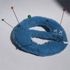

Internet Explorer fait l'objet de nombreuses critiques, on l'accuse de tous les maux, on le dénigre. Et pourtant, force est de constater que **nous en sommes totalement dépendant** lors du travail d'intégration web. Je suis souvent stupéfait des débats suscités par le navigateur. Je suis la plupart du temps amusé de lire par-ci par là des billets d'humeur d'[intégrateurs se demandant sur leur blog si l'on doit continuer de développer pour Internet Explorer](http://www.parenthese.be/2007/11/27/faut-il-adapter-son-site-a-internet-explorer/ "Voir le billet sur le blog Paranthese.be"). D'autres vont jusqu'à affirmer qu'il ne faut plus prendre en compte Internet Explorer parce qu'il ne respecte pas les standards.

En règle générale, ces discussions ne mènent pas loin et suscitent beaucoup plus de réactions que de véritables réflexions sur la question de fond. Selon moi, elle ne devrait même pas se poser surtout si l'on doit réaliser un travail d'intégration sur un site de grande ampleur. S'il s'agit d'un site personnel ou expérimental, libre à celui qui le décide de ne développer que pour les navigateurs respectant les standards. Autrement, **on ne peut pas priver les 70 % des personnes** utilisant le navigateur de la firme de Redmond.

Il est toujours possible de réaliser un site acceptable sur les différents navigateurs web sans passer pour autant par des hacks en tout genre ou des commentaires conditionnels recommandés par Microsoft. On accuse fréquemment Internet Explorer de foirer la mise en page alors qu'**il s'agit bien souvent d'éléments mal positionnés** dans le flux ou de flottant qui ne devraient pas en être. Je ne réfute pas la présence de bugs (argh le bug des doubles marges...) mais il faut parfois essayer de comprendre la raison pour laquelle le navigateur n'affiche pas le document correctement. Cela peut permettre de trouver des placements beaucoup plus appropriés.

Je ne suis pas fermés aux avancées des autres navigateurs tels que Firefox ou encore Opera et je suis bien évidemment favorable à ces évolutions. Je suis même devenu un utilisateur régulier de ces deux navigateurs. Aujourd'hui, Microsoft s'est finalement mis à repenser entièrement son navigateur à tel point que la version béta 8 peut déjà se targuer de passer le test Acid. **Je suis persuadé que les choses vont dans le bon sens** et que l'on se dira dans quelques années que les versions antérieures à la 7 n'étaient qu'un vieux cauchemar. Tout ce qui est Microsoft n'est pas forcément à jeter ;)