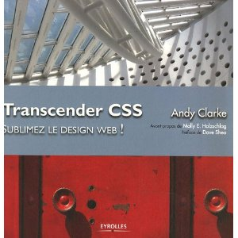

Actuellement je lis _Transcender CSS_, un livre d'Andy Clarke qui est l'un des designers web les plus doués. Il participe notamment au groupe de travail du <abbr title="World Wide Web Consortium">W3C</abbr> et à déjà publié des articles sur le fameux site [A List Apart](http://www.alistapart.com/ "Visiter le site A List A Part"). **C'est LE livre que j'attendais depuis longtemps**. Cet ouvrage, très illustré (j'adore...), traite du webdesign à l'aide des feuilles de style <abbr title="Cascading Style Sheet">CSS</abbr>. Ma partie préférée concerne l'élaboration d'un design web à l'aide d'une grille (c'est d'ailleurs ce que j'ai utilisé pour le design de ce blog...). Andy Clarke évoque également les micro-formats, les règles de base d'accessibilité. Le point de vue de l'auteur est parfois discutable mais je pense que **Transcender** <abbr>**CSS**</abbr> **peut être considéré comme une référence** en terme de publication sur le graphisme web via <abbr>CSS</abbr>. Un livre à mettre donc entre toutes les mains des webdesigner.

*   Le site web dédié à cet ouvrage : [transcendingcss.com](http://www.transcendingcss.com/ "Visiter le site web dédié à l'ouvrage")