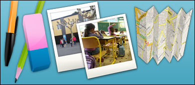
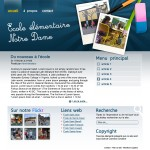

Actuellement en plein travail sur un projet web, j’ai quelque peu délaissé mon carnet web. Je me suis dis que ce serait intéressant de raconter à la manière d’un journal de bord les différentes étapes de la création d’un site internet. Nous allons donc voir une réalisation web sous tous ses aspects.

## Le sujet

Il s’agit d’un site internet pour une école privée. L’objectif est de faire connaître l’établissement. Le site internet sera un moyen de communiquer avec les familles. Il devra faciliter la prise de contacts avec les parents. L’ergonomie est au centre de ce projet. Le site doit disposer d’une navigation simplifiée au maximum, l’ensemble des sections doit être correctement délimité. On retrouvera notamment une partie "actualité", des articles plus spécifiques sur les activités de l’école et un agenda.

Concernant les contraintes techniques, le site devra disposer d’un espace d’administration simple d’utilisation. Les personnes qui mettront à jour le site ne seront pas des informaticiens. Il faut leur simplifier la tâche. Le choix d’un gestionnaire de contenu (<abbr title="Content Management System">CMS</abbr>) se révèle judicieux sur le plan technique. Il faudra toutefois veiller à ce que ce gestionnaire ne soit pas une "usine à gaz" et qu’il réponde à l’ensemble des besoins.

## Premiers préparatifs

Avant de me lancer dans la création graphique, j’ai étudié plusieurs possibilités de mise en page. Sur une feuille de papier, j’ai essayé différents placements possibles. Cet étape permet de débuter sereinement l'agencement des différents blocs de contenu sur la future maquette. Cela nous donne aussi l’occasion de déterminer les éléments sur lesquels on souhaitera attirer l’attention du visiteur. Pour respecter les besoins de navigation aisée dans le site, je me suis basé sur un système de navigation des plus conventionnels.

Pour trouver l’inspiration, je me suis mis à flâner sur des sites internet en rapport avec le monde de l’enfance. Quel dommage d’ailleurs que la majorité de ces portails ne soient pas très jolis graphiquement… Mais cela permet de faire naître des idées pour les premières maquettes du site en question.

## La création graphique

La maquette graphique du site internet doit mettre en valeur l’objet du site internet. Il faut avoir à l’esprit que cette maquette sera déclinée au format web (<abbr title="Extensible HyperText Markup Language">XHTML</abbr> / <abbr title="Cascading Style Sheet">CSS</abbr>), il faut parfois calmer ses ardeur :). Il faut également avoir une idée de l’orientation graphique. A défaut, plusieurs axes de communication pourront être proposés. Dans le cas présent, les éléments graphiques doivent évoquer le monde de l’enfance. Le site doit toutefois rester structuré dans sa forme. L’ambiance générale doit être colorée et agréable.



Dans un premier temps, j’ai réalisé dans Photoshop des objets propres au milieu scolaire. Ils ne seront pas tous intégrés mais pourront être réutilisés à l’occasion pour des mises à jour éventuelles. J’ai ainsi créé des fichiers psd (photoshop) de pinceaux, stylos, taille-crayon, tableau noir etc.…

[](2304647008_558833ef7b_o.jpg)Vient ensuite la maquette du site. Je débute l’agencement des différents blocs pour ensuite y intégrer les éléments décoratifs et les textes factices. J’ai pris pour habitude de travailler avec une grille pour respecter certaines règles de proportion ([le nombre d’or](http://fr.wikipedia.org/wiki/Nombre_d%27or "Voir la définition sur Wikipédia")). Pour le titre du site, je me suis inspiré de l'écriture à la craie des instituteurs sur les tableaux d'école. Le header très fourni intègre quelques-un des éléments que j'avais créé au préalable. J'ai choisi de ne pas créer de divisions explicites entre les blocs. Le travail sur les dégradés m'a permis de donner cet effet de séparation entre les éléments. Il s'agit de mon premier travail sur la maquette du site. Les couleurs sont très sobres. J'ai utilisé volontairement des blocs très rectilignes. La grille m'a permis de respecter les proportions de rigueur. Au final, la sobriété de la maquette n'était pas probante.

[](2304650826_29b1a0f7da_o.jpg)J’ai donc utilisé l’outil de Teinte/Saturation pour rechercher les teintes adéquates. J'ai noté certains codes couleurs qui me semblaient appropriés et retravaillé les blocs de contenu. Les couleurs ont gagné en vivacité. J'en ai également profité pour repenser le menu supérieur en y intégrant des post-it. J'ai effectué plusieurs tests pour évoquer le monde de l'enfance avec notamment le petit dessin bordant le titre du site.  
Au final, l'ensemble manquait toujours d'impact. La vision de l'utilisateur resterais bloqué sur ce fameux header imposant. Il fallait mettre en valeur le contenu principal.

[](2308730234_0ed9cdd172_o.jpg)L’apparence de la seconde maquette manquait d’éléments de contraste. De ce fait, j’ai intégré un footer noir/gris afin de bien différencier la bannière supérieure, le contenu et le footer. J'ai redessiné le petit personnage. Je lui ai même présenté un nouveau petit camarade ;) Cette troisième maquette m'a également permis de penser à la manière de présenter la page d'accueil. J'ai ajouté deux blocs très colorés pour y insérer les éléments communicatifs, c'est-à-dire les accroches. Le menu latéral a également été simplifié. C'est cette maquette qui servira de base pour l'intégration XHTML / CSS

Après avoir achevé la maquette définitive du site, je suis ensuite passé au travail le plus intéressant, celui de l’intégration. J’ai commencé par comprendre mon document. Qu’est-ce que ma page raconte ? Qu’est-ce qu’elle laisse transparaitre. Je peux ainsi mettre des noms sur les différents éléments présents dans la page : menu général du haut, titre de niveau 1, menu latéral des rubriques… Cette étape va me permettre de visualiser les différentes balises les plus adaptées aux différentes parties du document et délimiter les différentes zones (header, footer…).

On peut avoir plusieurs interprétations d’une mise en page et toutes sont contestables. Chacun peut avoir son idée sur la question mais la démarche de conception du document XHTML de manière sémantique est déjà une grande étape. Le travail d’intégration n’est pas un simple collage du travail graphique mais une interprétation sémantique de la maquette graphique.

Comme le dit si bien [Molly E. Holzschlag](http://www.peachpit.com/articles/article.aspx?p=369225 "Voir l'article de Molly E. Holzschlag sur la sémantique dans les document XHTML") :

> Dans le balisage, la sémantique traite du sens d’un élément et de la manière dont celui-ci est décrit dans son contenu. <cite>Molly E. Holzschlag</cite>

Une fois cette réflexion effectuée, je me suis mis à la première mise en application de mon schéma de balises. J’ai construis mon document sans penser une seule fois à l’apparence qu’il pourra avoir ensuite. Je me suis contenté de reprendre les balises et de les organiser de manière logique. Cette méthode permettra à votre document d’avoir du sens avec ou sans style. La mise en forme graphique sera l’affaire des feuilles de style.

Voici un extrait du schéma adopté :

```html
<h1>Ecole primaire et maternelle Notre Dame</h1>
<h2>Faches-Thumesnil</h2>
<ul>
	<li><a href="#">Accueil</a></li>
	<li><a href="#">A propos</a></li>
	<li><a href="#">Contact</a></li>
</ul>

<h3>Vivre ensemble</h3>
<p>A l’école Notre-Dame située à Faches-Thumesnil, <strong>l’épanouissement de votre enfant est pour nous un devoir.</strong><br />
Au cours de sa scolarité, l’enfant aura accès à de nombreuses activités favorisant ainsi son bien-être au sein de l’école.</p>
```

Vous aurez sans-doute remarqué l’ajout d’une balise H2 qui n’était pas présente sur la maquette. Elle servira uniquement de balise utile au référencement et qui sera masquée sur le document visible par l’utilisateur.

Il est important d’éviter de surcharger le document en balisage superflu uniquement pour satisfaire ses besoins graphiques. On peut souvent se passer de calques (div). La balise UL peut être également utilisable pour créer un fond autour des différentes puces. L’objectif est d’avoir un document HTML qui se charge rapidement. Sur cette maquette, j’ai pu obtenir une mise en page comptant 124 lignes de balises XHTML là où j’aurais pu en faire le double si j’avais multiplié les DIV. En clair, il faut éviter tout balisage superflu.

Pendant l’étape de mise en code, j’ai régulièrement passé mon code au validateur W3C, on est jamais à l’abri d’une petite erreur.

Une fois mon code XHTML établi, j’ai pu me lancer dans la création de la feuille de style. Je me suis efforcé de bien organiser les différentes parties du document. Ainsi les propriétés relatives au header, corps de page, footer sont regroupées afin d’améliorer la lecture de la feuille CSS. Je n’utilise jamais de hacks dans mes feuilles de style. Au pire des cas (et vraiment en dernier recours), j’insère une feuille supplémentaire avec un commentaire conditionnel dans la page. Je pars du principe que toute mise en page peut être réalisée sans bidouilles. Cette démarche pose toutefois quelques limitations : L’absence de pseudo-classe :focus, la mise à disposition de la pseudo-classe :hover avec des possibilités réduites, l’utilisation d’images au format PNG transparentes.

Ces limitations, je les dépasse souvent à l’aide de JavaScript. On me reprochera de ce fait d’alourdir la page en scripts supplémentaires pour palier aux limitations de certains navigateurs et je répondrais que l’utilisation de fichier *.htc pour ajouter le :hover ou le :focus est aussi du JavaScript injecté différemment. Je profiterais même de cette évocation du fichier .*htc pour préciser que l’utilisation de cette méthode dans les feuilles de style pour intégrer des PNG lisibles sous Internet Explorer est une aberration. Cette pratique non-valide W3C va à l’encontre du principe même de la feuille CSS qui est sensée appliquer un style au document et non pas destinée à lancer des fonctions JavaScripts.

Vers la fin de l’intégration de ma maquette, je me suis permis quelques petites « folies » JavaScript sur la page afin de la rendre plus animée. Il faut toutefois éviter de devenir gadget !

## Conclusion

Au final, je suis parvenu à réaliser une mise en page lisible sur l’ensemble des navigateurs couramment utilisés tout en ayant un code propre et une feuille de style dépourvue de hacks en tout genre.

Vous pouvez visualiser l’intégration de la maquette en vous rendant sur [cette page](assets/demos/24032007/ "Voir le résultat de l'intégration XHTML / CSS").
