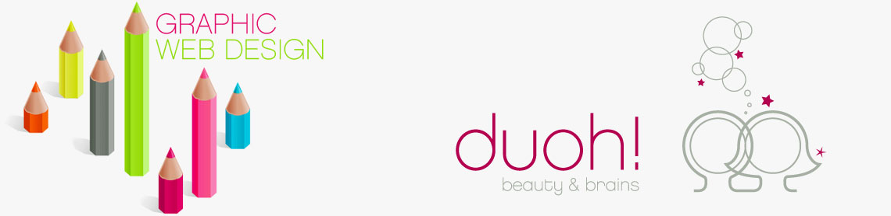
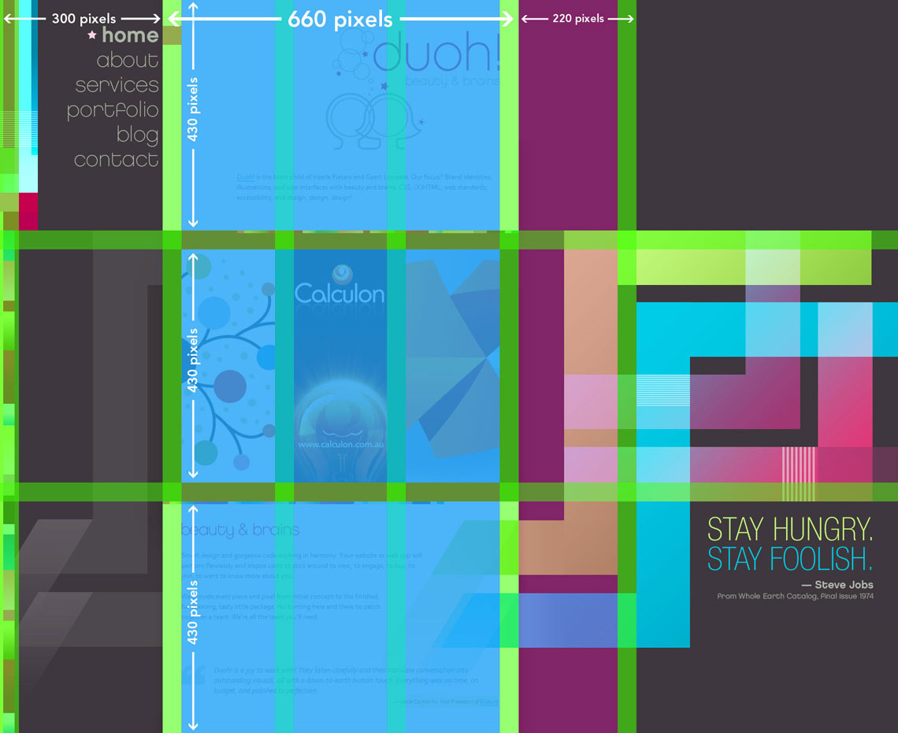
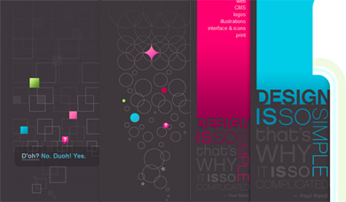
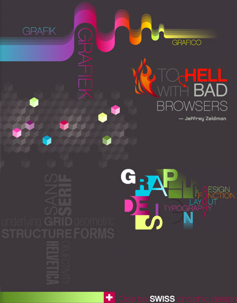

Après un petit congé billet, je me redécide à écrire un billet à l’occasion de la publication récente de la nouvelle version du site <a hreflang="en" href="http://www.duoh.com/?rel=http://behaba.com">Duoh</a>. Pourquoi ce site ? Parce qu’il est un exemple d’innovation en matière de webdesign.

Trop de sites sont réalisés par des designers qui n’ont pas de réelle vision web et il ne faut en aucun cas les blâmer mais il serait grand temps d’avancer et de laisser le webdesign à des gens qui ont été formés pour ça et de ce fait, proposer enfin, de vrai formation dans ce domaine. Le webdesign répond à des contraintes d’ergonomie, d’accessibilité, de sémantique et d’intégration. L’art est secondaire (troll ?). La maquette web est au service du contenu et non pas l’inverse.

Revenons donc à Duoh.com. Définissons d’abord ce qu’ils font. C’est une agence de design web et print qui existe depuis 1992 et composée de deux personnes : Geert Leyseele, le directeur de projet et Veerle Pieters au secteur de l’illustration et ’intégration. Duoh produit essentiellement de l’interface web mais également des logos, des illustrations, des icones et enfin du print.

<!--more-->

Nous allons étudier dans un premier temps l’aspect graphique puis nous nous concentrerons sur l’aspect technique.

### Une grille peu conventionnelle

Réalisée sous Illustrator, la maquette du site Duoh.com a pris un certain nombre de liberté graphique. Il ne s’agissait pas ici de s’enfermer dans les contraintes d’une grille.

Pourtant la tentation aurait été grande. On sait à quel point le design suisse (design que voulais évoque le nouveau Duoh) est très cubique et il aurait été évident de se caler précisément sur une grille régulière. Mais ici, il fallait du mouvement, de la vie. Comme on peut le voir sur l’image ci-dessous, certains éléments sont délibérement décalés par rapport à la grille de base.

<figure class="large">

  
  <figcaption>Grille du site Duoh.com</figcaption>
  
</figure>

Cela créé une certaine dynamique dans la mise en page. L’idée est également d’avoir un aspect différent à chaque scroll dans la page.

<figure class="alignright">

  
  <figcaption>Quelques illustration de la sidebar</figcaption>
  
</figure>
Concernant le choix des couleurs, là aussi, l’originalité était de mise. La maquette est un vrai arc-en-ciel. Une dizaine de couleurs ont été utilisées (rien que ça !). Mais c’est surtout leur utilisation qui est intéressante. On peut observer en fond de page, une gris très foncé (#3e373c) et dans la zone principale de contenu du blanc. En termes de contraste, on ne peut pas faire mieux. Et sur cette structure monochrome, viennent s’ajouter des couleurs « flashy » qui donnent force et vivacité.

Chaque maquette de page se présente comme une surprise pour le visiteur. Le fond de page change en permanence. En voici quelques exemples ci-dessous :

Il en est de même pour la sidebar…

### L’innovation dans l’intégration

Si l’on met de côté un instant l’aspect graphique, on pourra remarquer un certain nombre de techniques d’intégration assez intéressantes et qui peuvent être aussi contestables.

Pour ce qui est des remplacements de texte par des images dans le menu principal, il y a un choix d’utiliser des balises span vides. A première vue, ça peut faire enrager les adeptes de la validité stricte ! Mais là, il est question d’accessibilité. En effet, contrairement aux techniques de remplacements d’image utilisées largement (text-indent :-9999px ou top :-9999px), il n’y aura aucun de souci lors de la lecture de la page si la CSS est activée et si les images ne sont pas chargées. L'astuce est de placer les span avec pour fond l'image au dessus (en position absolue) du texte.

Il peut paraitre également surprenant de trouver parfois des remplacements de texte par des images qui n’ont pas du tout le même contenu. Il y a par exemple sur la page Contact us, un titre de niveau 2 qui contient le texte « Contact us for an estimate? » et qui sous forme d’image est remplacé par « Want a site that beautiful and brainy too ? » ou le texte sur la homepage « Who we are » qui est tout bonnement remplacé par une image de séparation. J’argumenterais qu’ici on différencie l’aspect que le site aura lorsqu’il sera chargé avec tous les éléments graphique et son aspect dans aucune illustration. Aucun aspect n’est handicapé par ces pratiques et l’utilisateur ne manque aucune informations d’un coté comme de l’autre.

<figure class="alignright">

  
  <figcaption>Illustrations dans le fond de page du site Duoh</figcaption>
  
</figure>

Ce qui a le plus perturbé les utilisateurs au premier coup d’œil sur ce site est l’utilisation de l’espace par la mise en page. Le site a été pensé de manière à ce qu’il soit agréable à lire autant sur des petites résolutions que sur des énormes résolutions (type iMac).Ce qui a rebuté plus d’un utilisateur est le fait qu’on ne puisse pas avoir accès sur les résolutions 1024*768 aux citations. D’autres qui avaient des résolutions intermédiaires se lamentaient d’avoir des citations coupées.

Ce genre de commentaires sont anti-productifs et ne feront jamais avancer le web. Il faut replacer le projet dans un contexte. Ici on parle de la vitrine d’un site de création web et print et pas d’un site destiné à un client. Ici, l’aspect novateur est qu’aucune résolution ne souffre de la mise en page. Le site s’adapte très bien à tout type d’écran. Il est enfin plaisant pour des personnes ayant des résolutions de type 1900*1200 de naviguer sur des sites web.

On notera également l’utilisation de la police de caractère Corbel (police distribuée avec Vista) et qui est remplacée par l’Helvetica au cas où cette dernière n’est pas disponible.

### Au rang de la technique

Le site utilise le CMS <a hreflang="en" href="http://www.expressionengine.com/index.php?affiliate=veerlesblog&amp;page=/overview/">Expression Engine</a> et est hébergé chez <a hreflang="en" href="http://enginehosting.com/">Engine Hosting</a> qui met à disposition ce CMS de base. Je ne connais pas encore totalement cet outil, je suis dans la découverte mais il semble qu’il soit très souple et offre grand nombre de fonctionnalités.

Les pages pèse en moyenne 200 ko, les fichiers les plus lourds étant les images de fonds bien évidemment mais on a rien sans rien :)

Coté javascript, Duoh a fait le choix « tendance » de la librairie <a hreflang="en" href="http://www.mootools.net">Mootools</a>. Ce qui est dommage, c’est d’avoir utilisé une librairie javascript uniquement pour les effets d’images sur la homepage et pour les tooltips de la sidebar. Là encore, ça se discute…

Le site est strictement valide W3C sur le code XHTML. Seule la CSS ne valide pas mais est-ce bien grave ?

### Conclusion

Veerle qui a réalisé la maquette et l’intégration html de Duoh propose sans cesse ses idées en matière d’illustrations ou de réalisations web et Duoh.com constitue, une fois de plus, une nouvelle source d’inspiration.

Je vous invite à consulter ces liens pour plus d’informations :

*   [New Duoh! dot com has launched](http://veerle.duoh.com/blog/comments/new_duoh_dot_com_has_launched/)
*   [Tweaks to Duoh! dot com](http://veerle.duoh.com/blog/comments/tweaks_to_duoh_dot_com/)
