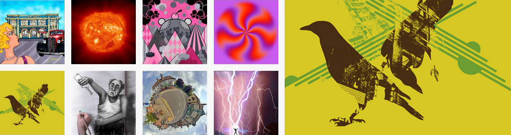

Avec l'arrivée des nouvelles propriétés CSS3 (dont la spécification n'est toujours pas finalisée...), il est devenu assez facile de créer des sites internet attrayants sans pour autant avoir recours à Flash ou à JavaScript.

Dans la [démonstration associée à cet article](http://clearideaz.com/assets/demos/CSS-Highlight/ "CSS3 Highlight, une galerie photo full CSS"), vous aller pouvoir visualiser quelques possibilités offertes par CSS3.



## Le pseudo-selecteur :target

:target est un pseudo-sélecteur permettant d'accéder à un élément du DOM possédant l'id du lien référent.
En clair, si je clique sur un lien dont l'attribut href est égal à ```#test```, la propriété de style ```a:target { background-color:red; }``` affectera un fond de couleur rouge à l'élément ayant pour ID ```#test```.

C'est de cette manière que j'obtiens la méthode de sélection des images agrandie dans la démo. Pour IE qui ne supporte par cette propriété, j'ai bidouillé grâce à l'overflow. En clair, le cadre conteneur des images agrandies a pour attribut overflow, la valeur hidden. Il dispose en outre des dimensions exactes d'une de ces images. Au clic sur le lien de la miniature, l'image cible est directement appelée par le hash du lien.

<!--more-->

## Les ombres

Pour la démo, j'ai utilisé la propriété box-shadow afin de mettre en valeur l'image miniature survolée. La syntaxe est simple :

```css
-moz-box-shadow:0 0 0 rgba(255,255,255,0.5);
-webkit-box-shadow:0 0 0 rgba(255,255,255,0.5);
```

Il est à noter que cette propriété à été retiré pour le moment de la spécification CSS3.

## La propriété transform

Cette propriété permet d'agir sur la forme d'un élément, qu'il s'agisse d'une image ou de toute autre balise standard.

Il est par exemple possible d'effectuer une rotation sur un objet via cette syntaxe :

```css
img {
  transform:rotate(20deg);
}
```

Il vous sera également possible de mettre à l'échelle certains éléments. Voici un exemple :

```css
div#button {
  transform:scale(0.8); /* réduira la div de 20% */
}
```

Sur la démonstration, je m'en suis servi pour agrandir les miniatures au survol de la souris.

## Les transitions

J'ai également utilisé les <em>transitions</em> (qui ne fonctionnent qu'avec la version 3.7 de Firefox et avec les dernières versions de Safari).  Les transitions CSS permettent de modifier les  valeurs de propriétés CSS progressivement, sur une durée déterminée. On construit la valeur en spécifiant d'abord la ou les propriétés sur lesquelles on souhaite agir (background-color par exemple ou all pour toute les propriétés liées au sélecteur), on indique ensuite une durée d'animation (en secondes ou millisecondes), puis le type d'effet de transition (default, linear, ease-in, ease-out, ease-in-out ou cubic-bezier).
Voici un exemple de propriété :

```css
transition: all 1s ease-in-out;
```

Les animations de la galerie CSS3 utilisent pleinement les possibilités offertes par les transitions.

Dernière astuce liées à cette propriétés : pour donner cette impression d'image tournoyante lorsqu'une miniature est sélectionnée, j'ai juste initialisée la rotation de l'image à -360 degrés. Une fois l'image sélectionnée, l'image cible (:target) subit une rotation de 0 degré.

## La démonstration

Voici donc [la démonstration d'une galerie full-CSS](http://clearideaz.com/assets/demos/CSS-Highlight/ "CSS3 Highlight, une galerie photo full CSS"). Pour le fun, visualisez cette galerie sur différents navigateurs (IE 6, Firefox 3.6, Safari). Vous verrez ainsi que la galerie utilise le concept d'[amélioration progressive](http://fr.wikipedia.org/wiki/Am%C3%A9lioration_progressive "La définition Wikipédia de l'amélioration progressive").

Édit le 04/10/2010 : MAJ de la feuille de style suite au commentaire de mekal. Le zip est à jour également sur [mon espace GitHub](http://github.com/behaba/CSS-Highlight "Espace de partage de code source Github de Clearideaz").

*   [Accéder à la démonstration](http://clearideaz.com/assets/demos/CSS-Highlight/ "Visualiser la démo de CSS3 Highlight, une galerie photo full CSS")
*   [Télécharger la démo](http://github.com/clearideaz/CSS-Highlight/zipball/1.0 "Télecharger la démo de CSS3 Highlight, une galerie photo full CSS")