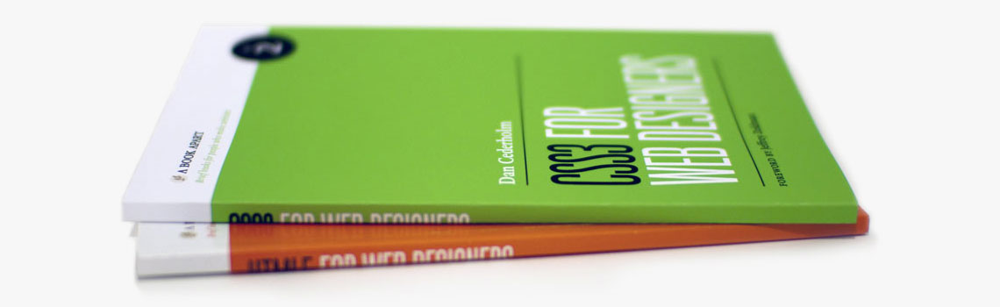

Récemment, l'agence [AL'X Communication (agence de conseil en communication web et stratégie de développement)](http://www.alx-communication.com/?rel=http://clearideaz.com "AL'X Communication, L'agence RP des coulisses du web") m'a fait parvenir un exemplaire du livre ["CSS3 pour les web designers"](http://www.eyrolles.com/Informatique/Livre/css3-pour-les-web-designers-9782212129878?rel=http://clearideaz.com "CSS3 pour les web designers par Dan Cederholm aux éditions Eyrolles").

<figure class="large">

  
  <figcaption>Photo originale par <a href="http://v4.jasonsantamaria.com/articles/css3-for-web-designers/">Jason Santa Maria</a></figcaption>
  
</figure>

Dans ce livre, Dan Cederholm de [Simple Bits](http://simplebits.com/ "Handcrafted pixels & text from Salem, Massachusetts") fait le tour de la plupart des nouveautés apportés par CSS3 et de manière assez ludique. Contrairement à beaucoup de livres informatiques, la compréhension des différentes propriétés et techniques sont appréhendées dès la première lecture. Pour certains, ce livre sera une vraie découverte, pour d'autre, il apportera une nouvelle manière de voir certaines propriétés CSS grâce notamment aux exemples traités.

Et je terminerais en remerciant [l'agence AL'X](http://www.alx-communication.com/?rel=http://clearideaz.com "AL'X Communication, L'agence RP des coulisses du web") pour avoir eu l'amabilité de me faire parvenir une copie de cet ouvrage vraiment passionnant.