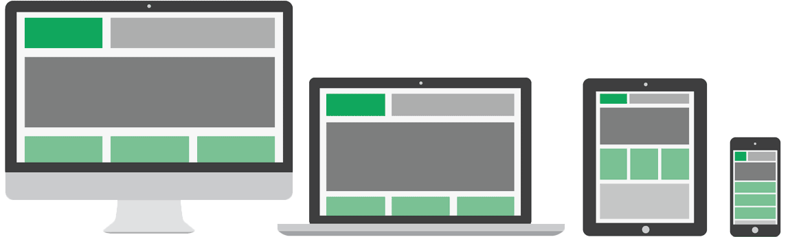

## Qu’est ce que le responsive web design ?

Il s’agit en fait d’adapter une mise en page de site internet en fonction de la résolution des terminaux. Au moment du développement du web mobile, les techniciens proposaient une version dédiée des sites internet. Mais cette solution a des limites. Internet en 2011, parmi les 34.4 millions d'internautes, on comptait 18.3 millions de clients mobile et 2 millions d’utilisateur tablettes soit plus de 50% de l’audience totale. Avec la multiplication des types de plates-formes, la tâche se compliquait.  
Le « responsive webdesign » utilise les possibilités offertes par les nouvelles spécification CSS (feuille de style) et notamment les media queries (styles conditionnels en fonction de la résolution d’écran ou du type de format : impression / écran).

<figure class="large">

  
  <figcaption>Illustration <a href="http://www.shutterstock.com/">Shutterstock</a></figcaption>

</figure>

[Ethan Marcotte](http://alistapart.com/article/responsive-web-design) le définit de cette manière :
> Récemment, une discipline émergente appelée "responsive webdesign" poser la problématique de l’agencement des espaces physiques en fonction de la provenance des visiteurs. (…) En bref, nous sommes confrontés à un plus grand nombre de dispositifs, de modes d’entrée, et navigateurs que jamais. (…) Notre compréhension du responsive design devrait être élargie afin de couvrir toute approche qui délivrerait des interfaces riches de qualité, indépendamment de la taille de l’écran de l’utilisateur et des limites ou des capacités de l’appareil
 
Concevoir ce type de page pose des contraintes graphiques. Les éléments doivent pouvoir facilement «épouser» les différents formats de page. Pour se lancer dans ce type de mise en page, il est important que l’intégrateur HTML/CSS et le webdesigner communiquent.

## Les contraintes du responsive webdesign

Nous ne parlerons pas de limites mais bien de contraintes techniques car il s'agit ici de penser différemment la mise en page du site internet et ce, dès le web design.

### Une philosophie de conception différente

Afin de d’assurer le bon fonctionnement du schéma responsive, il est préférable de commencer par la maquette « faible résolution ». Autrement dit, nous créerons dans un premier temps la version mobile.  
La maquette graphique correspond également à une analyse des besoins en communication.  
En outre, le webdesigner doit être sensibilisé aux contraintes du responsive webdesign Comme pour les sites traditionnels, le webdesigner doit s'assurer de la faisabilité du projet. Ces maquettes doivent être suivie avec attention par le développeur front-end.

### Une approche axée sur le contenu

La raison de la visite d’un site peut différer selon que l’internaute soit sur un support ou un autre. Sur un mobile, nous avons tendance à survoler rapidement pour accéder au contenu qui nous intéresse. Sur un grand écran, l’utilisateur va être plus sensible à des éléments graphiques qui viendront agrémenter et mettre en valeur le contenu. C’est sur cette problématique précisément qu’entre en jeu la stratégie rédactionnelle. Créer une maquette avec du faux-texte (Lorem Ipsum) n’a aucun sens. Etre en mesure d’avoir du contenu prêt à être intégré et préférable pour garantir un contenu correctement hiérarchisé.  
L’avantage de cette approche est qu’elle privilégie une communication directe sans équivoque.

Le concept de "mobile first" dont l'idée est de créer la maquette de base pour mobile et de décliner les versions annexes renforce ce recentrage sur le contenu.
On cible de prime abord le format mobile en identifiant les contenus principaux. Cela permet de travailler en amont une bonne hiérarchie de l’information.
Cela permet également de « forcer » à avoir une stratégie web définie en amont, afin d’arbitrer les sections à mettre en valeur ou non sur le site mobile, et donc par extension sur le site web traditionnel.

### Des compétences techniques et ergonomiques
Etre en mesure de livrer une prestation de ce type impose d’être capable de faire les bon choix en terme d’agencement de l’info et en terme de choix technique.  
Globalement, les colonnes doivent pouvoir s’ajuster, se déplacer, voire disparaître. Les images se redimensionneront, se repositionneront dans le flux du contenu. Les choix techniques et ergonomiques influent fortement sur la réussite d’un design réactif. Cumuler ces compétences d’expertise technique et ergonomique d’un site est essentiel à la réalisation du projet.

 
### Un coût plus élevé

En définitive, un site « responsive » est une vraie étude qui mériterait même une partie dédiée  sur le devis tant les domaines d’intervention sont importants. L’envergure des projets conditionne ce surcoût. Ce coût est toutefois à nuancer. En effet, il serait certainement plus onéreux pour le client de développer une version mobile, une version tablette et une version traditionnelle.
 
### Une maintenance à assurer

La multiplication des supports de cesse d’évoluer. Il est peut être intéressant d’effectuer un suivi client en rapport avec l’évolution technique (Ex. l’internet sur TV).

## L’ergonomie et les performances appliquées au responsive webdesign

### Ergonomie

Ré agencer les éléments du site web ne suffit pas à offrir une meilleure expérience au visiteur, il est nécessaire d’offrir également au client une prestation concernant l’ergonomie. En effet, on ne navigue pas sur un smartphone comme sur un ordinateur. La navigation avec menu déroulant utilisable en format standard ne le sera plus sur un format mobile. En fonction de la complexité de la maquette, cette étude ergonomique prendra plus ou moins de temps mais elle est nécessaire afin de garantir un fonctionnement optimal pour les différents supports. Une étude peut être également menée pour les terminaux tactiles dans l’objectif d’être toujours plus proche des comportements utilisateurs. C'est définitive une expérience utilisateur innovante appréciée des internaute. Un site proposant une expérience utilisateur optimisée est un site sur lequel les internautes reviendront.

### Typographie

Livrer un site responsive permet de fournir un premier (et non des moindre) niveau  d’accessibilité. La lisibilité est un paramètre à prendre en compte sur les différents types d’écrans. Une typo minimale de 16 pixels sur les formats mobile est recommandée mais chaque cas est différent en fonction de la famille de police utilisée.

### Poids

Beaucoup de sites dits « responsives » apparaissent comme épurés. Ceci n’est pas forcément relatif à des contraintes techniques mais plus pour des raisons de performances. En effet, le débit d’une connexion EDGE sur mobile est différent de celui d’un ordinateur profitant d’une connexion haut-débit. De ce fait, les éléments de type image sont en général appelés avec parcimonie pour garantir un chargement optimal.
 